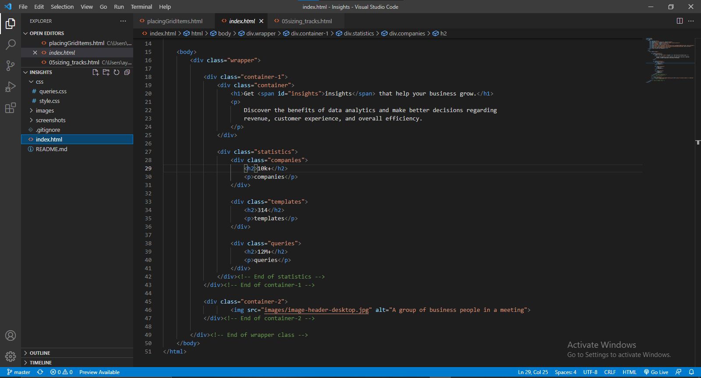
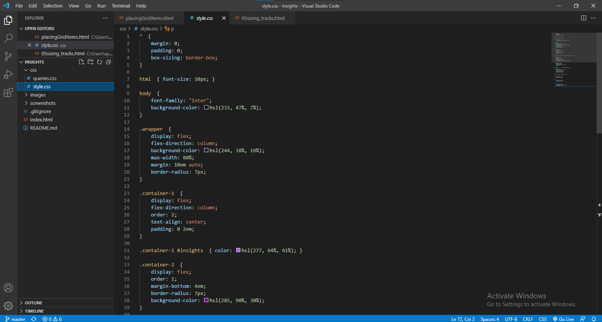
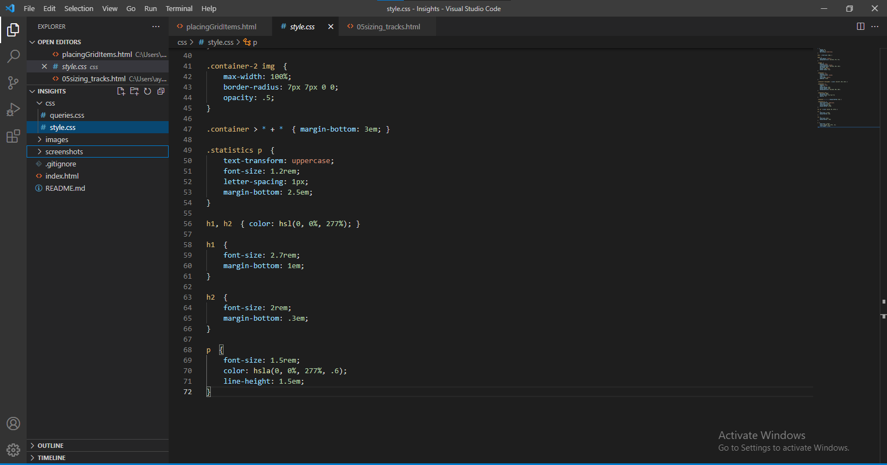
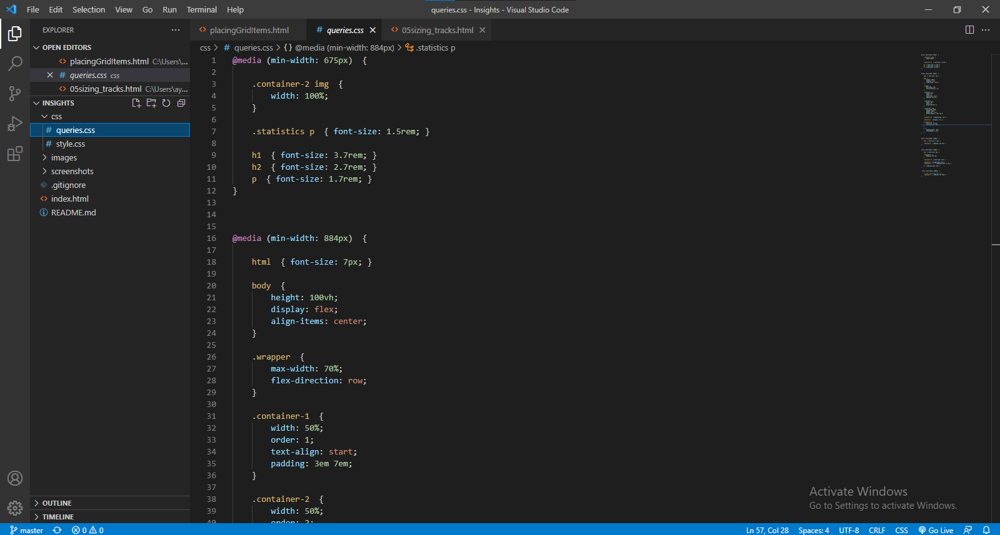
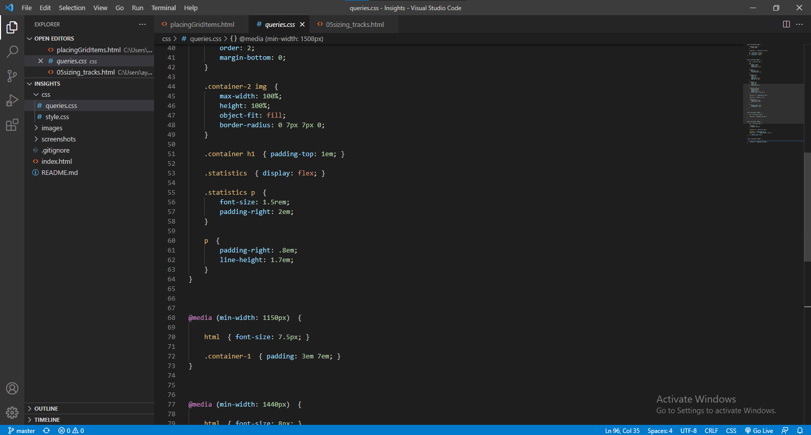
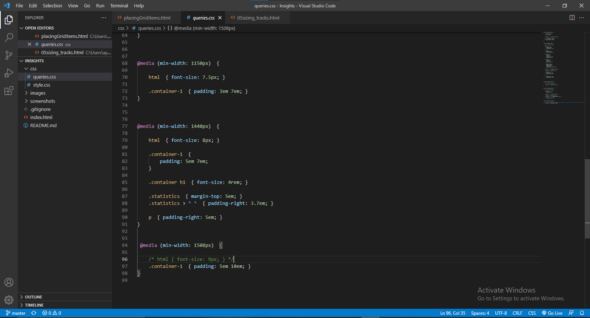

# Frontend Mentor - Stats preview card component solution

This is a solution to the [Stats preview card component challenge on Frontend Mentor](https://www.frontendmentor.io/challenges/stats-preview-card-component-8JqbgoU62). Frontend Mentor challenges help you improve your coding skills by building realistic projects.

## Table of Contents

- [Overview](#overview)
  - [The challenge](#the-challenge)
  - [Screenshot](#screenshot)
  - [Links](#links)
- [My process](#my-process)
  - [Built with](#built-with)
  - [What I learned](#what-i-learned)
  - [Continued development](#continued-development)
  - [Useful resources](#useful-resources)
- [Author](#author)
- [Acknowledgements](#acknowledgements)

## Overview

### The challenge

My challenge was to build the component card and get it looking as close to the original design as possible.

Users should be able to:

- View the optimal layout depending on their device's screen size.

### Screenshot

### Links

## My process

### Built with

- Flexbox
- Mobile-first workflow

### What I learned

During the course of building the project, I came to a light of coding the media queries (responsiveness) from a different perspective.

Rather than having to build the desktop layout first (which is the norm for most developers), I approached the design from the mobile layout first

before having to design the desktop layout with media queries. Taking this approach at first was quite challenging for me at first, but after much 

attempts at building the card over and over again, designing the desktop layout with media queries became clearer and easier for me.

Also, I used ems and rems for my paddings, margins and font size. These css units proved to very handy whilst dealing with responsiveness.

### Continued development

- Responsive layout (media queries)

- Flexbox

## Author

- Frontend Mentor - [@Tzienom](https://www.frontendmentor.io/profile/Tzienom)